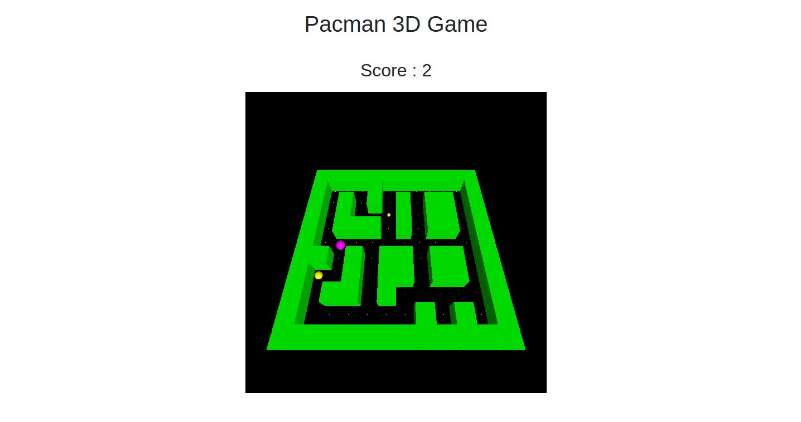

# Pacman3DGame

Developed by:** Justin Foltz
**Date** : 12.2019

## The project

Pacman3DGame is a web game from Pacman realized in 3D thanks to the ThreeJS library. The goal is to collect all the food present in the different levels by moving Pacman thanks to the keyboard keys. Each time, enemies are present and automatically move in the direction of Pacman by estimating, for each frame, the best direction to take. 

## Technologies

ThreeJs, Bootstrap, JQuery

## How to launch the project

To launch the project it is simply necessary to open the *Pacman3D.html* file in a browser.
The project has only been tested on firefox.